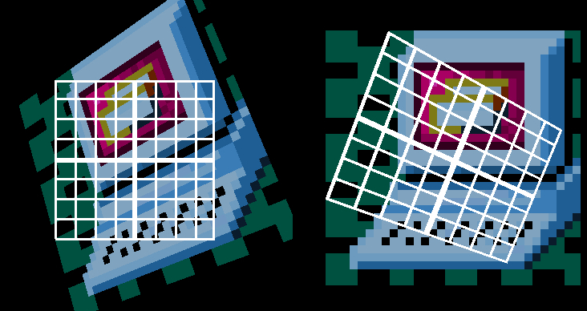
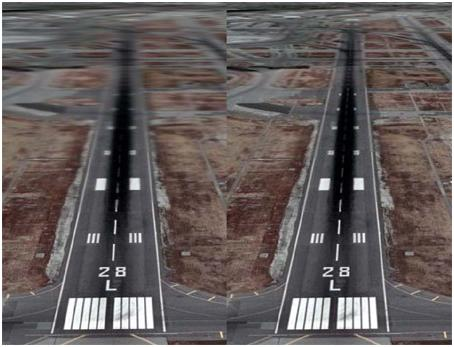
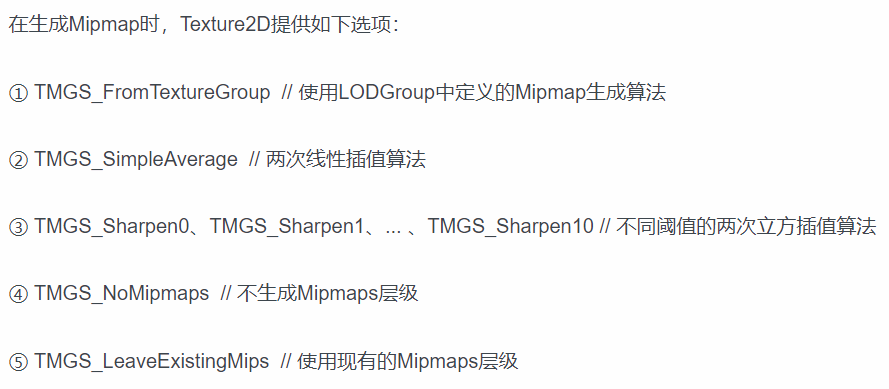
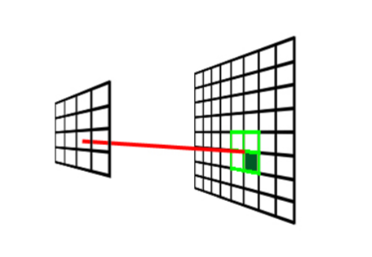

### Mipmap
首先需要明确 mipmap 的作用。在纹理渲染的时候，需要渲染区域与纹理本身的尺寸通常是不相符的，那么就需要针对不同的 __尺寸__ 则需要获取原本纹理数据上对应位置的像素信息。那么有两个问题：

- 按照原有纹理，当我们确定了 uv 坐标之后因为不对应像素点，如何保证获取合适的像素数据。
- 在三维空间下，产生的像素网格扭曲会导致像素的大小不一致，如下图：

若不存在 mipmap 以及对应的采样方法最后会导致的问题如下图：

根据上方的两个产生的纹理，接下来我们会逐步的进行讲解。在这之前，我们化繁为简，对应上方的两个问题，在纹理渲染过程中需要设定两种情况：
1. texture_mesh 为各向同性的情况。
2. texture_mesh 为各项异性的情况。

这两种情况下我们应当使用不同的过滤采样方案。
按照上文提及的问题以及解决方案，下面我们需要了解的内容为 mipmap 的生成与应用。

mipmap 是按照特定的过滤算法生成一系列可以成为 __金字塔__ 尺寸的图形，对应的图形尺寸通常为 256 * 256, 128 * 128, 64 * 64······根据以上原则，mipmap 在生成过程中提供以下几种常用算法：
- 最近点采样（Nearest Point Sampling）
- 双线性过滤（Bilinear Filtering）
- 三线性过滤（Trilinear Filtering）
- 各向异性过滤（Anisotropic Filtering）

详细的算法在下面的文段中会有粗略的介绍，那么具体的实现方案可以参考 texture.js 脚本中的代码。

根据本段的内容来明确需求：
1. 实现 texture 类
2. 实现 mipmap，生成对应的金字塔图片普通的平均或者是 gammar 校正（目前可能没什么太大作用）。mipmap 除了一般的平均算法在　DX 中似乎还有这其他的计算方式，目前不做深究，下图仅供参考:

3. 实现纹理映射，即各向异性过滤算法。最终完成纹理绘制。

实现过程：
1. 首先需要离屏渲染一个 texture 作为我们需要的对象获取其像素数据。
2. 根据 texture 的尺寸，确认金字塔的最大与最小尺寸 map，从单位的角度考虑，按照 texture 原尺寸， uv 坐标对应的尺寸应该为选取 map 的 size，最后再归一化。
3. 选取对应的采样计算方式
4. 对应的三角形填充方案，要从对应的 uv 坐标下获取对应的像素数据填充进入三角形

残留思考问题：
1. mipmap 某一级的的 texture 为下一级的 2 次幂，那么非 2 次幂纹理如：1366 * 960 如何处理 mipmap 计算。因为这个涉及更深层次的实用问题，优先度较低，暂时就不做深入思考了。
我的解释：
游戏行业以及图形渲染相关行业不同于其他行业内容对于纹理材质要求有固定的尺寸需求，类似于上文的特殊格式图片，应该不会生成 mipmap 而是采用直接渲染的方式在场景中生成 texture 对象，至于如何缩放，那就是各家引擎自己的算法问题了，大部分应该也是依赖于 opengl 或者 DX 自身的设计。

#### 最近点采样
首先从一个比较简单的图来看：
;
十分容易实现的一个效果。

- - -
uv 坐标：
以左下角为原点的二维坐标系（笛卡尔坐标系），横纵坐标区间通常为 [0~1] 用于记录当前需要绘制纹理对象对应图片像素对应的获取区间。
texture_mesh:
这里我们用于代指 mipmap_mesh 中较为形象的像素网格。

- - -
参考文献：
https://graphics.ethz.ch/teaching/former/vc_master_06/Downloads/Mipmaps_1.pdf
一篇不知名的 PPT

https://www.lihuasoft.net/article/show.php?id=4509（貼圖 filtering 與 MIP map 簡介）

http://www.techbrood.com/zh/news/webgl/ %E7%BA%B9%E7%90%86%E5%9F%BA%E7%A1%80%E7%9F%A5%E8%AF%86%E5%92%8C%E8%BF%87%E6%BB%A4%E6%A8%A1%E5%BC%8F%E8%AF%A6%E8%A7%A3.html （纹理基础知识和过滤模式详解）